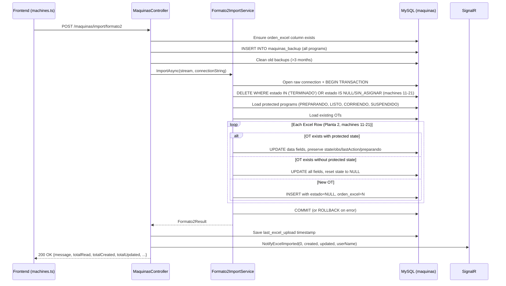

# Design Document: Planta 2 Import Fix

## Overview

Rewrite `Formato2ImportService.ImportAsync` to apply the same protections as the normal import flow (`ProcessProgramaCCWorksheet` in `MaquinasController.cs`). The fix uses raw MySQL connections with explicit transactions, backup creation, selective deletion (only TERMINADO + SIN_ASIGNAR for machines 11-21), protected state preservation on UPDATE, `orden_excel` tracking, SignalR notification, and last upload timestamp saving. The architecture splits responsibilities: the controller handles backup/SignalR/timestamp (mirroring the normal import), while the rewritten service focuses on intelligent import logic with transactions.

## Glossary

- **Formato2ImportService**: Backend service (`backend/Services/Implementations/Formato2ImportService.cs`) responsible for parsing and importing Planta 2 Excel files into the `maquinas` table.
- **Protected States**: Program states that must survive import operations: PREPARANDO, LISTO, CORRIENDO, SUSPENDIDO.
- **Disposable States**: Program states safe to delete during import: TERMINADO, SIN_ASIGNAR (NULL or empty).
- **orden_excel**: Integer column tracking the row order from the Excel file.
- **maquinas_backup**: Table storing snapshots of programs before import for recovery purposes.
- **SignalR**: Real-time notification system used to notify connected frontend clients about data changes.

## Bug Details

The `Formato2ImportService.ImportAsync` method uses a destructive import approach: it deletes ALL programs per machine (except CORRIENDO and TERMINADO), then re-inserts everything from the Excel. This destroys programs with protected states (PREPARANDO, LISTO, SUSPENDIDO) that are being actively worked on. Additionally, it lacks backup creation, transaction management, order tracking, SignalR notification, and timestamp saving — all protections that the normal import flow (`ProcessProgramaCCWorksheet`) already implements.

## Expected Behavior

The Formato 2 import should behave identically to the normal import flow:
1. Create a backup before modifying data
2. Only delete programs with disposable states (TERMINADO, SIN_ASIGNAR)
3. For existing OTs with protected states: UPDATE data fields but preserve state metadata
4. For existing OTs without protected states: UPDATE all fields, reset state
5. For new OTs: INSERT with estado=NULL
6. Wrap everything in a transaction with rollback on failure
7. Track orden_excel for row ordering
8. Notify clients via SignalR after success
9. Save last upload timestamp

## Hypothesized Root Cause

The `Formato2ImportService` was written as a quick adaptation of the original import logic before the protection mechanisms were added to the normal flow. It uses EF Core's `ExecuteSqlRawAsync` for deletion (which deletes everything except CORRIENDO/TERMINADO) and `_context.Maquinas.Add()` for insertion, without any awareness of protected states, backup, transactions, or post-import hooks. The normal import was later upgraded with these protections but the Formato 2 service was never synchronized.

## Fix Implementation

### Architecture



### Changes Required

**File 1: `backend/Services/Implementations/Formato2ImportService.cs`** — Full rewrite

Remove EF Core dependency (`FlexoAPPDbContext`). The service now receives a `connectionString` and manages its own raw MySQL connection + transaction internally.

```csharp
public class Formato2ImportService
{
    private readonly ILogger _logger;

    public Formato2ImportService(ILogger logger)
    {
        _logger = logger;
    }

    public async Task<Formato2Result> ImportAsync(Stream fileStream, string connectionString)
    {
        // Full implementation with raw SQL, transaction, protections
    }
}
```

Key logic changes inside `ImportAsync`:
1. Open raw `MySqlConnection` (not EF Core)
2. Check if `orden_excel` column exists
3. DELETE only TERMINADO + SIN_ASIGNAR for machines 11-21:
   ```sql
   DELETE FROM maquinas 
   WHERE numero_maquina BETWEEN 11 AND 21 
   AND (estado = 'TERMINADO' OR estado IS NULL OR estado = '' OR estado = 'SIN_ASIGNAR')
   ```
4. Load protected programs into dictionary:
   ```sql
   SELECT ot_sap, estado, observaciones, last_action_by, last_action_at, preparando_started_at 
   FROM maquinas 
   WHERE estado IN ('PREPARANDO','LISTO','CORRIENDO','SUSPENDIDO') 
   AND numero_maquina BETWEEN 11 AND 21
   ```
5. Load all existing OTs into HashSet
6. Begin transaction
7. For each row: INSERT or UPDATE based on existence and protection status
8. Commit/Rollback

**File 2: `backend/Controllers/MaquinasController.cs`** — Revised `ImportFormato2` endpoint

Add the same pre/post import logic as `ImportFromExcelMultiSheet`:
- Ensure `orden_excel` column
- Create backup in `maquinas_backup`
- Clean old backups
- Call service with `connectionString` instead of `_context`
- Save `last_excel_upload` timestamp
- Send SignalR notification
- Return extended result with `totalUpdated`

**File 3: `backend/Services/Implementations/Formato2ImportService.cs`** — Updated `Formato2Result`

Add `TotalUpdated` and `ErrorDetails` fields:
```csharp
public class Formato2Result
{
    public int TotalRead { get; set; }
    public int TotalCreated { get; set; }
    public int TotalUpdated { get; set; }
    public int TotalErrors { get; set; }
    public int MachinesProcessed { get; set; }
    public string? Error { get; set; }
    public List<string> ErrorDetails { get; set; } = new();
}
```

### Protected State UPDATE Logic

When an existing OT has a protected state, only update Excel data fields:
```sql
UPDATE maquinas SET 
    numero_maquina = @mq, articulo = @art, cliente = @cli, referencia = @ref, 
    td = @td, tipo_impresion = @tipoImp, numero_colores = @numCol, colores = @colores,
    kilos = @kilos, metros = @metros, fecha_tinta_en_maquina = @fecha, sustrato = @sust,
    updated_at = @updAt, orden_excel = @orden
WHERE ot_sap = @ot
-- estado, observaciones, last_action_by, last_action_at, preparando_started_at NOT TOUCHED
```

When an existing OT does NOT have a protected state:
```sql
UPDATE maquinas SET 
    numero_maquina = @mq, articulo = @art, cliente = @cli, referencia = @ref, 
    td = @td, tipo_impresion = @tipoImp, numero_colores = @numCol, colores = @colores,
    kilos = @kilos, metros = @metros, fecha_tinta_en_maquina = @fecha, sustrato = @sust,
    estado = NULL, updated_at = @updAt, orden_excel = @orden
WHERE ot_sap = @ot
```

### Excel Parsing (Unchanged)

The existing flexible column detection logic is preserved:
- `FindColumn(headers, "Maquina", "Máquina", "MAQUINA")`
- `FindColumn(headers, "ArticuloF", "Articulo F", "ARTICULOF")`
- `FindColumn(headers, "OT", "OT SAP")`
- etc.

Filter logic preserved: Only Planta 2, only machines 11-21.

### Error Handling

| Scenario | Behavior |
|----------|----------|
| Transaction failure mid-import | Rollback all changes, return error with 0 created/updated |
| Backup table doesn't exist | Log warning, proceed with import (non-blocking) |
| Missing "Maquina" column | Return error immediately, no data modified |
| SignalR/timestamp failure | Log warning, import already committed (non-blocking) |
| Duplicate OT in Excel | Skip duplicate, increment error count |
| Invalid row data (parse error) | Log error, skip row, continue processing |

## Correctness Properties

*Properties that should hold true across all valid executions of the fixed import logic.*

### Property 1: Protected State Preservation

*For any* import operation where an existing OT has a protected state (PREPARANDO, LISTO, CORRIENDO, SUSPENDIDO), after import the program's estado, observaciones, last_action_by, last_action_at, and preparando_started_at SHALL remain unchanged from their pre-import values.

**Validates: Requirements 2.1, 2.3**

### Property 2: Transaction Atomicity

*For any* import operation, either ALL rows are committed successfully (totalCreated + totalUpdated > 0 and no transaction error), OR the database state is completely unchanged from before the import began (rollback executed, totalCreated = 0, totalUpdated = 0).

**Validates: Requirements 2.4**

### Property 3: Selective Deletion

*For any* import operation on machines 11-21, only programs with estado IN ('TERMINADO', NULL, '', 'SIN_ASIGNAR') are deleted. Programs with estado IN ('PREPARANDO', 'LISTO', 'CORRIENDO', 'SUSPENDIDO') are never deleted by the import process.

**Validates: Requirements 2.1**

### Property 4: Order Tracking Consistency

*For any* successful import, every inserted or updated row has a unique positive `orden_excel` value that corresponds to its sequential position among processed Excel rows (first processed row = 1, second = 2, ..., Nth = N).

**Validates: Requirements 2.5**

### Property 5: Backup Before Modification

*For any* import operation, the backup INSERT into `maquinas_backup` is attempted before any DELETE or UPDATE on the `maquinas` table, ensuring a recovery point exists.

**Validates: Requirements 2.2**

### Property 6: Planta 2 Machine Filter Invariant

*For any* import operation, no row with a machine number outside the range 11-21 is inserted, updated, or deleted in the database. Programs belonging to machines outside this range remain completely unaffected.

**Validates: Requirements 3.1, 3.4**

## Testing Strategy

### Unit Testing Approach

- Test Excel parsing logic with sample XLSX files containing various column layouts
- Test `ExtractMachineNumber` with different machine code formats ("IMPCOM0015", "15", "MQ15")
- Test decimal parsing for kilos/metros with different locale formats (dot vs comma separators)
- Test date parsing with OA dates and string dates
- Verify `Formato2Result` counts are consistent after import

### Integration Testing Approach

- Import a file with machines 11-21 and verify only Planta 2 rows are processed
- Import over existing protected programs and verify state preservation
- Import with data that triggers a transaction failure and verify rollback leaves DB unchanged
- Verify backup table receives correct data before import
- Verify SignalR notification is sent after successful import
- Verify system_configs is updated with correct timestamp
- Verify normal import (`/maquinas/import/excel-multisheet`) continues to work unchanged
