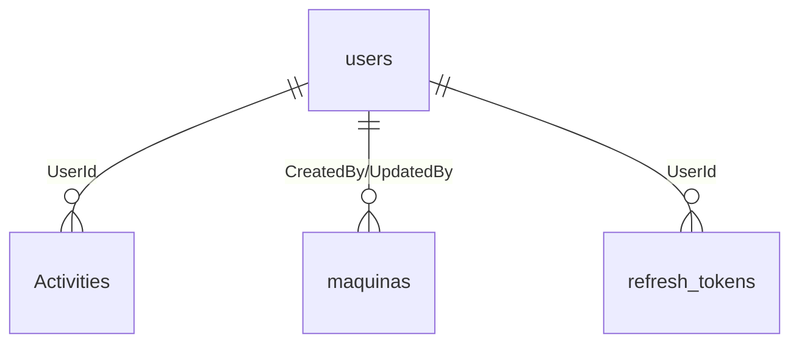

# 🗄️ Base de Datos - FlexoAPP

Esta carpeta contiene toda la configuración y scripts relacionados con la base de datos MySQL de FlexoAPP.

## 📁 Estructura

```
Database/
├── Scripts/           # Scripts SQL de creación de tablas
│   ├── 00_MASTER_SETUP.sql
│   ├── 01_CREATE_USERS_TABLE.sql
│   ├── 02_CREATE_ACTIVITIES_TABLE.sql
│   └── ... (más scripts)
├── Migrations/        # Migraciones de Entity Framework
└── Setup/            # Scripts de configuración adicional
```

## 🚀 Configuración Inicial

### 1. Ejecutar Scripts de Base de Datos

**Opción A: Script Maestro (Recomendado)**
```bash
# En Railway/Render MySQL
mysql -h hopper.proxy.rlwy.net -P 43791 -u root -p railway < Scripts/00_MASTER_SETUP.sql
```

**Opción B: Desde la aplicación**
Los scripts se ejecutan automáticamente al iniciar la aplicación si las tablas no existen.

### 2. Verificar Configuración

```sql
-- Verificar tablas creadas
SHOW TABLES;

-- Verificar usuario por defecto
SELECT * FROM users WHERE UserCode = 'admin';
```

## 🗂️ Esquema de Base de Datos

### Tablas Principales

#### 👥 users
- **Propósito**: Gestión de usuarios del sistema
- **Clave primaria**: `Id` (INT AUTO_INCREMENT)
- **Campos únicos**: `UserCode`
- **Relaciones**: Referenciada por múltiples tablas

#### 📊 Activities
- **Propósito**: Log de actividades del sistema
- **Clave primaria**: `Id` (INT AUTO_INCREMENT)
- **Relaciones**: FK hacia `users`

#### 🎨 designs
- **Propósito**: Diseños flexográficos
- **Clave primaria**: `Id` (INT AUTO_INCREMENT)
- **Características**: Soporte para hasta 10 colores

#### 🏭 maquinas
- **Propósito**: Programas de máquinas flexográficas
- **Clave primaria**: `ot_sap` (VARCHAR)
- **Características**: Validación de números de máquina (11-21)

#### 📋 condicionunica
- **Propósito**: Condiciones únicas de artículos
- **Clave primaria**: `Id` (INT AUTO_INCREMENT)
- **Características**: Índice único por artículo+referencia

#### 📄 Documento
- **Propósito**: Gestión de documentos
- **Clave primaria**: `DocumentoID` (INT AUTO_INCREMENT)
- **Características**: Metadatos completos y control de acceso

#### 🔑 refresh_tokens
- **Propósito**: Tokens de actualización JWT
- **Clave primaria**: `Id` (INT AUTO_INCREMENT)
- **Características**: Gestión de expiración y revocación

## 🔗 Relaciones entre Tablas



## 🛠️ Configuración de Entity Framework

### Connection String (Producción)
```json
{
  "ConnectionStrings": {
    "DefaultConnection": "Server=hopper.proxy.rlwy.net;Port=43791;Database=railway;User=root;Password=***;AllowUserVariables=True;UseAffectedRows=False;SslMode=Required;"
  }
}
```

### DbContext
- **Archivo**: `Data/Context/FlexoAPPDbContext.cs`
- **Proveedor**: MySQL (Pomelo.EntityFrameworkCore.MySql)
- **Características**: 
  - Auto-detección de versión MySQL
  - Retry automático en fallos
  - Logging sensible solo en desarrollo

## 📈 Optimizaciones

### Índices Implementados
- **Búsquedas frecuentes**: UserCode, timestamps, estados
- **Claves foráneas**: Todas indexadas automáticamente
- **Texto completo**: En tabla Documento para búsquedas

### Constraints de Validación
- **Rangos numéricos**: Números de máquina, cantidades positivas
- **Estados válidos**: Enums definidos para estados
- **Integridad referencial**: Claves foráneas con cascada apropiada

## 🔐 Seguridad

### Características Implementadas
- **Passwords hasheados**: BCrypt para usuarios
- **Tokens seguros**: JWT con refresh tokens
- **Auditoría completa**: Tracking de cambios
- **Validación de datos**: Constraints a nivel de BD

### Permisos Requeridos
```sql
-- Permisos mínimos para la aplicación
GRANT SELECT, INSERT, UPDATE, DELETE ON railway.* TO 'app_user'@'%';
GRANT CREATE, ALTER, INDEX ON railway.* TO 'app_user'@'%';
```

## 🚨 Troubleshooting

### Problemas Comunes

#### Error de conexión
```bash
# Verificar conectividad
mysql -h hopper.proxy.rlwy.net -P 43791 -u root -p
```

#### Tablas no creadas
```sql
-- Verificar si existen
SELECT COUNT(*) FROM information_schema.tables 
WHERE table_schema = 'railway';
```

#### Error de charset
```sql
-- Configurar charset correcto
SET NAMES utf8mb4;
ALTER DATABASE railway CHARACTER SET utf8mb4 COLLATE utf8mb4_unicode_ci;
```

## 📝 Mantenimiento

### Tareas Regulares
1. **Limpieza de logs**: Actividades antiguas
2. **Limpieza de tokens**: Tokens expirados
3. **Backup**: Respaldo regular de datos
4. **Optimización**: Análisis de consultas lentas

### Scripts de Mantenimiento
```sql
-- Limpiar actividades antiguas (>90 días)
DELETE FROM Activities 
WHERE Timestamp < DATE_SUB(NOW(), INTERVAL 90 DAY);

-- Limpiar tokens expirados
DELETE FROM refresh_tokens 
WHERE ExpiresAt < NOW() OR IsRevoked = 1;
```